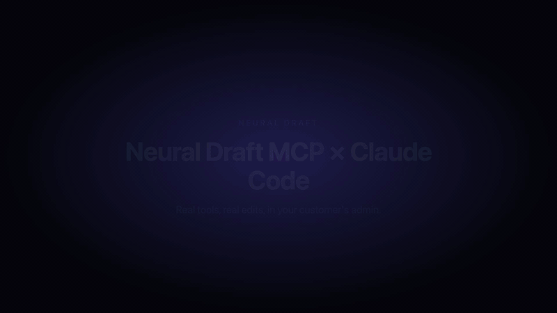

# @neuraldraft/mcp

> Make AI-built sites real businesses. Plug Neural Draft's CMS, blog, social, booking, and commerce APIs into Claude Code, Cursor, Continue, and any other MCP client.

[](https://www.npmjs.com/package/@neuraldraft/mcp)
[](https://www.npmjs.com/package/@neuraldraft/mcp)
[](LICENSE)
[](https://registry.modelcontextprotocol.io)

## What it does

`@neuraldraft/mcp` is a [Model Context Protocol](https://modelcontextprotocol.io) server that gives AI coding tools first-class access to the [Neural Draft](https://neuraldraft.io) backend platform. When your AI assistant builds a site, it can:

- read your project's brand context (voice, colors, fonts, audience)
- register every section it generates as an editable component in your admin
- create translation keys, kick off blog/image generation, list products, set up booking widgets
- emit markup that's CMS-managed by default — no manual wiring

## Demo

A real Claude Code session driving Neural Draft via MCP. One natural-language prompt creates 4 translation keys (EN + HR) and registers a hero image.



[Watch the full MP4 →](./assets/demo.mp4)

## Why it exists

AI codegen tools (Lovable, Claude Code, v0, Bolt, Cursor) are excellent at building frontends. They're terrible at the bits that make a frontend a real business — multi-language CMS, blog pipelines, social scheduling, bookings, e-commerce. Neural Draft is the backend that handles those. This MCP server is the wire between the two: the AI tool generates code that uses Neural Draft correctly **by default**, because the conventions and tools are exposed as MCP context.

The pitch: *"Build your site with Lovable. Run the actual business on Neural Draft."*

## Quick install

You need a Neural Draft project API key. Get one at [neuraldraft.io/dashboard/api-keys](https://neuraldraft.io/dashboard/api-keys). Test-mode keys (`ndsk_test_…`) work out of the box.

### Claude Code

`~/.config/claude-code/mcp.json`:

```json
{
  "mcpServers": {
    "neuraldraft": {
      "command": "npx",
      "args": ["-y", "@neuraldraft/mcp"],
      "env": {
        "NEURALDRAFT_API_KEY": "ndsk_live_xxxxxxxxxxxxxxxxxxxxxxxx"
      }
    }
  }
}
```

Or use the CLI:

```bash
claude mcp add neuraldraft \
  -e NEURALDRAFT_API_KEY=ndsk_live_xxx \
  -- npx -y @neuraldraft/mcp
```

### Cursor

`.cursor/mcp.json` (workspace) or `~/.cursor/mcp.json` (global):

```json
{
  "mcpServers": {
    "neuraldraft": {
      "command": "npx",
      "args": ["-y", "@neuraldraft/mcp"],
      "env": {
        "NEURALDRAFT_API_KEY": "ndsk_live_xxxxxxxxxxxxxxxxxxxxxxxx"
      }
    }
  }
}
```

### Continue

`~/.continue/config.yaml`:

```yaml
experimental:
  modelContextProtocolServers:
    - transport:
        type: stdio
        command: npx
        args: ["-y", "@neuraldraft/mcp"]
      env:
        NEURALDRAFT_API_KEY: ndsk_live_xxxxxxxxxxxxxxxxxxxxxxxx
```

Then restart your editor. You should see `neuraldraft` listed under MCP servers, with resources, tools, and prompts available.

## Auth setup

The server reads two environment variables (set by your MCP client config — never commit them):

| Variable | Required | Default | Notes |
|---|---|---|---|
| `NEURALDRAFT_API_KEY` | yes | — | Project API key. Format: `ndsk_live_…` or `ndsk_test_…` |
| `NEURALDRAFT_API_URL` | no | `https://api.neuraldraft.io/v1` | Override the API base. Useful for staging or local dev. |
| `NEURALDRAFT_PROJECT_ID` | no | (derived from key) | Override when one key spans multiple projects. |
| `NEURALDRAFT_DISPLAY_NAME` | no | — | Friendly name shown in your IDE's MCP list when you run multiple projects. |

`NEURAL_DRAFT_*` (with underscore) is also accepted as an alias for any of the above.

## What it exposes

### Resources (read-only context)

| URI | What |
|---|---|
| `brand://current` | Project brand: voice, audience, content tone, colors, fonts, logo, target topics |
| `schema://blog-post` | JSON schema for blog post API responses |
| `schema://product` | JSON schema for product API responses |
| `schema://booking` | JSON schema for bookable services + bookings |
| `conventions://editable-html` | The `data-translate` / `data-image-key` markup spec the AI should follow |
| `conventions://api-usage` | Auth, errors, rate limits, idempotency, async/job patterns |

### Tools (functions the AI can call)

| Tool | Description |
|---|---|
| `get_brand` | Read the project's brand context (industry, audience, voice, colors, fonts) |
| `update_brand` | Patch brand fields (voice, audience, colors, fonts, languages) |
| `register_component` | Register generated HTML as editable in the admin. Call once per section. |
| `generate_blog_post` | Kick off the AI blog pipeline (research → draft → image → SEO → translations) |
| `get_blog_post` | Fetch a single blog post by id or slug (locale-aware) |
| `list_blog_posts` | Paginated list with status / language / category / tag filters |
| `update_blog_post` | Patch a post's title / body / SEO meta / status |
| `generate_image` | Brand-consistent image generation (returns a Job) |
| `list_images` | List registered image keys |
| `get_image` | Resolve a single registered image URL by key |
| `register_image` | Bind a direct image URL to a stable key (no AI) |
| `replace_image` | Swap an image by URL or AI regeneration |
| `delete_image` | Remove an image-key registration |
| `generate_video` | Brand-aware video clip — budget (40 cr) or premium (300 cr) tier |
| `create_page` | Create a TenantPage with per-page SEO meta |
| `list_pages` | Paginated list of pages |
| `get_page` | Fetch a page by id or slug (full SEO meta) |
| `update_page` | Patch page fields and / or SEO meta (merge semantics) |
| `create_translation_keys` | Bulk-create translation keys with default values |
| `get_content` | Read a single translation key (resolved value + all_locales) |
| `list_content` | Paginated key list with search / scope / language filters |
| `list_products` | List the project's products (paginated) |
| `get_product` | Fetch a single product by id or slug |
| `create_bookable_service` | Create a bookable service (time-slot or date-range) |
| `setup_booking_widget` | Get the embeddable booking widget HTML for a service |
| `list_newsletter_subscribers` | List captured newsletter subscribers |
| `list_contact_form_submissions` | List captured contact-form submissions |
| `get_usage` | Current credit balance, monthly limit, reset date, breakdown |
| `get_job` | Poll an async job (blog/image/video generation) for completion |
| `find_workspaces` | List Neural Draft workspaces an email is registered against (calls the central host, not the per-tenant API) |

### Prompts (slash commands)

| Slash command | What it does |
|---|---|
| `/scaffold-marketing-site` | Generate a complete marketing site (hero, features, testimonials, pricing, CTA, footer) wired through Neural Draft |
| `/scaffold-blog-page` | Drop a `/blog` and `/blog/[slug]` page into an existing project |
| `/connect-existing-site` | Walk a developer through migrating an existing static site to Neural Draft |

## Examples

### 1. "Build me a blog page"

```
You: /scaffold-blog-page framework=next language=en

Claude: Reading brand://current… (voice: warm and grounded; audience: yoga-curious adults)
Claude: Reading schema://blog-post… (got it — id, slug, title, content, featured_image, tags, …)
Claude: Reading conventions://api-usage… (auth via Bearer ndsk_…, rate limit 60/min, RFC 7807 errors)

Claude: Generating /lib/neuraldraft.ts…
Claude: Generating /app/blog/page.tsx (index)…
Claude: Calling register_component { intent: 'blog_index_card', html: ... }
Claude: → cmp_2NgB7hKqL (edit at https://app.neuraldraft.io/c/cmp_2NgB7hKqL)

Claude: Generating /app/blog/[slug]/page.tsx…
Claude: Calling register_component { intent: 'blog_post_meta_block', html: ... }
Claude: → cmp_2NgC9qPLq (edit at https://app.neuraldraft.io/c/cmp_2NgC9qPLq)

Claude: Done. 2 components registered. Open the editor URLs to change copy.
```

### 2. "Add a hero with my brand colors"

```
You: Build a hero section that says "Find your calm" with a CTA to /book.

Claude: Reading brand://current… (deep sage #3F6B5C primary, linen #E8DCC4 secondary, Fraunces / Inter)
Claude: Reading conventions://editable-html… (every text node needs data-translate)

Claude: Calling generate_image { prompt: "Serene yoga studio at dawn, sage and linen tones, no people", aspect_ratio: "16:9", key: "hero.background" }
Claude: → job_img_7K9L (poll with get_job)

Claude: Drafting <section class="hero">…</section> with data-translate="hero.headline" / "hero.subhead" / "hero.cta"
Claude: Calling register_component { intent: "marketing_hero", page_slug: "home", html: ... }
Claude: → cmp_2NgD9KqL — translation keys created: hero.headline, hero.subhead, hero.cta.

Claude: I'll poll the image job…
Claude: Calling get_job { id: "job_img_7K9L" } → status: completed, url: https://cdn.neuraldraft.io/.../hero-bg.jpg

Claude: Done. The hero is in your admin (https://app.neuraldraft.io/c/cmp_2NgD9KqL) — you can change the headline, swap the image, or recolor without touching code.
```

### 3. "Set up a storefront for the products I already have"

```
You: I have 14 products in my Neural Draft project. Scaffold a /shop page.

Claude: Calling list_products { page_size: 20 } → 14 products returned (page 1/1).
Claude: Reading schema://product… (id, name, price_cents, currency, status, images, …)
Claude: Reading brand://current… (warm voice; primary #3F6B5C)
Claude: Reading conventions://editable-html…

Claude: Generating /app/shop/page.tsx with a grid of 14 ProductCard components.
Claude: Calling register_component { intent: "product_grid_header", page_slug: "shop", html: ... } → cmp_2NgE
Claude: Generating /app/shop/[slug]/page.tsx with get_product fetch + buy-button widget.
Claude: Calling register_component { intent: "product_detail_layout", page_slug: "shop_detail", html: ... } → cmp_2NgF

Claude: Done. The grid auto-renders your 14 products (real names, prices, images). Edit the page header in admin: https://app.neuraldraft.io/c/cmp_2NgE.
```

## Local development

```bash
git clone https://github.com/vbalagovic/neuraldraft-mcp.git
cd mcp
npm install
npm run lint    # tsc --noEmit
npm test
npm run build   # → dist/
```

Run against a local API:

```bash
NEURALDRAFT_API_KEY=ndsk_test_xxx \
NEURALDRAFT_API_URL=http://localhost:8080/v1 \
npm run dev
```

Inspect interactively with the official MCP Inspector:

```bash
npx @modelcontextprotocol/inspector node dist/index.js
```

(Or `npx @modelcontextprotocol/inspector --cli node dist/index.js --tool register_component --args '{"html":"<h1>Hi</h1>","intent":"hero"}'` for one-shot CLI calls.)

## Architecture

This server is a thin wrapper over the Neural Draft Project API v1. Every tool maps to one (or a handful of) REST calls; resources are either constants (schemas, conventions docs) or cached reads (`brand://current`). The full API spec lives at [openapi.yaml](https://github.com/vbalagovic/neuraldraft-mcp/blob/main/openapi.yaml) in the platform repo.

Stdio is the only transport in v0.x — every current AI coding tool spawns local processes. Streamable HTTP transport will arrive when there's hosted multi-tenant demand.

## Contributing

Issues and PRs welcome. See [open issues](https://github.com/vbalagovic/neuraldraft-mcp/issues) for places to start. PRs should:

- Keep tests at ≥ 80% line coverage on `src/`
- Use the existing `register*` helper pattern when adding tools/resources
- Never write to stdout in server runtime code (stdio mode breaks)
- Update the README's "What it exposes" table for any new surface

## Changelog

See [CHANGELOG.md](./CHANGELOG.md) (TBD — this is the first public release).

## License

[MIT](./LICENSE) — open-source from day one.

---

Built by [Neural Draft](https://neuraldraft.io). Questions? developers@neuraldraft.io.
